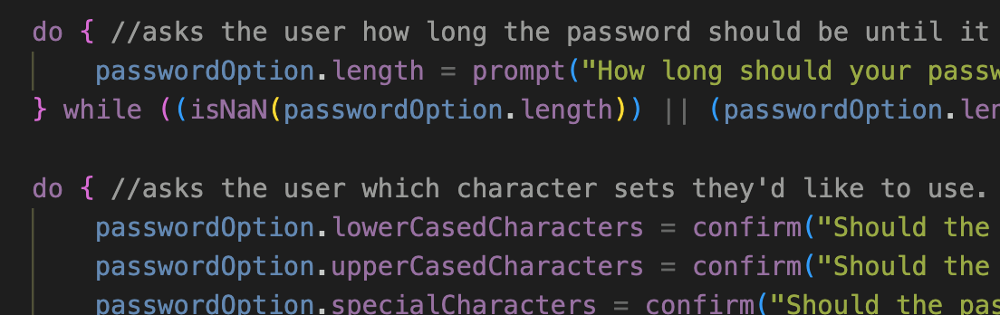

# password-generator

## Description
Building on our JavaScript fundamentals we were tasked with creating a password generator. The HTML and CSS were provided as starter code along with 4 arrays of characters. The challenge requested that a user is prompted to select the length of the password and which character sets it should contain, lowercase, uppercase, special and numeric characters.

Using Do, While blocks I made sure the user input a password length between 10 and 64 and had selected at least one character set. When they choose a character set the name of the set is added to an array.

The generate password function used the names of the character sets stored in the selectedOptions array to grab one random element at a time from one of those arrays and adds it to the passsword until the users desired length is reach. It then pushes the password to be displayed on the site.

## Deployed Site

https://roberttaylor94.github.io/password-generator/

